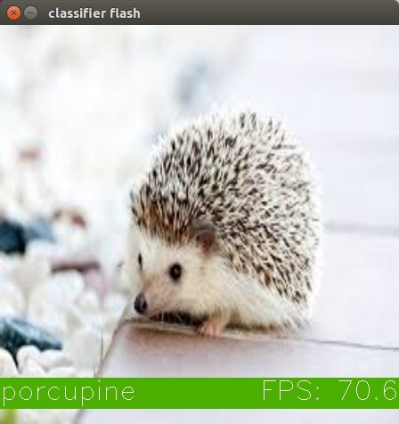
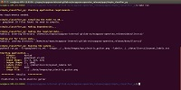
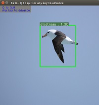

# Applications for the Intel® NCS 2 (or original NCS) with OpenVINO™ toolkit

This directory contains subdirectories for applications that use the Intel® NCS 2 via the OpenVINO™ toolkit.  Typically the applications here make use of one or more of the neural networks in the repository.  They are also intended to be more involved and provide more of a real world application for the networks rather than simply serving as an example of the technology.
The sections below are categorized by application type and present the currently available applications in the repository in succinct lists.

Each application directory has a README that explains how to build and run it, as well as a Makefile that automates the steps for you.  The links in the tables below will take you to the README files for each application.

## Image Classification Applications
Image classification applications typically use one of the image classification networks in the repository to classify an image as to it's likeliness to be in each of the classes on which a network was trained.
For a step by step tutorial on how to build an image classification network look at [Build an Image Classifier in 5 steps](https://movidius.github.io/blog/ncs-image-classifier/) at the Intel® Movidius™ Neural Compute Stick Blog

|Image Classification Application| Description |++++++Thumbnail++++++|
|---------------------|-------------|-------|
|[classifier_flash](classifier_flash/README.md) | Python Multiple Networks Classifies images from filesystem and displays them one by one in GUI| |
|[classifier_grid](classifier_grid/README.md) | Python Multiple Networks Classifies images from filesystem and displays a large grid highlighting each image as its classified. This application shows how to get the best performance out of the NCS and NCS 2 devices. | |
|[classifier-gui](classifier_gui/README.md) | Python Multiple Network GUI to select network and image to classify.||
|[gender_age](gender_age/README.md) | C++ Caffe AgeNet, GenderNet, face-detection-retail.0004 Uses the face detection and Age-Gender Network to predict age and gender of people in a live camera feed. The camera feed is displayed with a box overlayed around the faces and a label for the age and gender of the person. ||
|[mnist_calc](mnist_calc/README.md) |Python TensorFlow mnist_deep Network Handwriting calculator based on mnist.  Does digit detection on writen numbers to determine the equation and calculates the results.  A fun project to do with a Raspberry Pi and a touch screen!  ||
|[simple_classifier_cpp](simple_classifier_cpp/README.md) | C++ Multiple Networks Application reads a single image from the filesystem and does an image classification inference on that image. Takes the image, the network and a labels file on the commandline||
|[simple_classifier_py](simple_classifier_py/README.md) | Python Multiple Networks Application reads a single image from the filesystem and does an image classification inference on that image. Takes the image, the network and a labels file on the commandline||
|[simple_classifier_py_camera](simple_classifier_py_camera/README.md) | Python Multiple Networks Application reads a video stream from a camera and does image classification inference on the stream continually updating the top result.||

## Object Detection Applications
Object detection applications make use of one of the [object detection networks](TODO) in the repository to detect objects within an image.  The object detection networks typically determine where objects are within the image as well as what type of objects they are.

|Object Detection Application| Description |+++++Thumbnail+++++ |
|---------------------|-------------|-------|
|[birds](birds/README.md) | Python Caffe Tiny Yolo, GoogLeNet Detects and identifies birds in photos by using Yolo Tiny to identify birds in general and then GoogLeNet to further classify them. Displays images with overlayed rectangles bird classification. ||
|TBD                  |TBD          |TBD    |

## Misc Applications
Miscellaneous applications use the OpenVINO toolkit in various ways that don't fit into any of the above categories but can still be interesting.

|Misc Application| Description |+++++Thumbnail+++++ |
|---------------------|-------------|-------|
|[benchmark_ncs](benchmark_ncs/README.md) | Python Multiple Network Outputs FPS numbers for networks in the repository that take images as input. The number of NCS devices to use for the FPS numbers can be specified on the commandline.||

