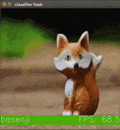

# classifier_flash
## Introduction
This app repeated does classification inferences on images from the filesystem and shows each image along with the classification and current FPS.  It makes use of the OpenVINO async api and is a good example of both how to scale and thread an OpenVINO application.  It looks like the following while running.



The FPS number shown will vary depending on the host system's ability to update the graphical window as well as other variables such as the display image size (window size).  This application shouldn't be used to benchmark the NCS performance for this reason.  

By default this example uses 3 threads per NCS device and creates 6 async inference requests per thread. Also by default, the application will run 500 inferences using [GoogLeNet](https://github.com/BVLC/caffe/tree/master/models/bvlc_googlenet).

There are lots of commandline arguments that can be used to override the defaults.  To see the supported commandline arguments run the program directly through the python interpreter rather than through the Makefile and pass "help" as the only argument like this `python3 classifier_flash.py help`. 

The provided Makefile does the following:
1. Builds the IR files using the model files from [Open Model Zoo](https://github.com/opencv/open_model_zoo).
2. Copies the IR files from the model directory to the project base directory.
3. Runs the sample.

## Running the Example
To run the example code do the following :
1. Open a terminal and change directory to the project base directory
2. Type the following command in the terminal: ```make run``` 

To get a list of commandline options type the following command: ```python3 classifier_flash.py help```

**Note**: The CPU device can be used with the example using the command: ```make run DEV=CPU```

**Note**: Other models can be used with the example.  

*Example of running sample on AlexNet:* ```make run XML=../../caffe/AlexNet/alexnet.xml BIN=../../caffe/AlexNet/alexnet.bin```

## Prerequisites
This program requires:
- 1 or more NCS devices
- OpenVINO 2019 R2 Toolkit
- OpenCV 3.3 with Video for Linux (V4L) support and associated Python bindings*.

*It may run with older versions but you may see some glitches such as the GUI Window not closing when you click the X in the title bar, and other key binding issues.

Note: All development and testing has been done on Ubuntu 16.04 on an x86-64 machine.

## Makefile
Provided Makefile has various targets that help with the above mentioned tasks.

### make run or make run_py
Runs the sample application.

### make help
Shows available targets.

### make all
Builds and/or gathers all the required files needed to run the application.

### make data
Gathers all of the required data need to run the sample.

### make deps
Builds all of the dependencies needed to run the sample.

### make install_reqs
Checks required packages that aren't installed as part of the OpenVINO installation. 

### make uninstall-reqs
Uninstalls requirements that were installed by the sample program.
 
### make clean
Removes all the temporary files that are created by the Makefile.
