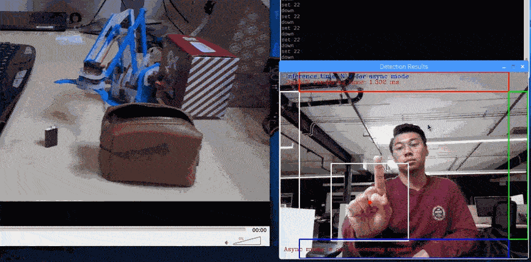

# Gesture PiArm

## Introduction
This project uses an optimized model for gesture recognition in order to control a robot without a physical interface. At the current stage of this project, the model utilized below is a pre-trained COCO SSD Inception V2 model trained further on a custom dataset of created and annotated gesture images. Gestures and hand placement relative to the camera view dictate the action of the MeArm Pi V3, the robot shown below.



The provided code does the following:
1. Provides a python library to control the MeArm V3.
2. Provides the gesture model used to control the robot.
3. Provides a plug-and-play python script for not only running the demo, but also for utilizing another model of choice if need be. If another model is utilized, editing of the demo python script may be required.

## Running the Example:

### Prerequisites:
- One Intel NCS 2 Device
- OpenVINO 2019 R2 (Python API)
- OpenCV with associated Python bindings*.
- a Raspberry Pi 3 B+
- Pigpio (a Python API for controlling the GPIO of the Raspberry Pi)
- An assembled and calibrated MeArm Pi V3 robot connected to the Raspberry Pi and the provided 6V power supply. Instructions to calibrate and build robot are featured later in this document.
- Custom MeArm Pi V3 python library (downloaded by the Makefile)

### Running Application with Makefile
Provided Makefile has various targets that help with the above mentioned tasks.
- **make run**: Runs the sample application.
- **make run_wout_arm_CPU**: Runs the sample application without robot on CPU
- **make run_wout_arm_MYRIAD**: Runs the sample application without robot using MYRIAD plugin
- **make help**: Shows available targets.
- **make all**:Builds and/or gathers all the required files needed to run the application.
- **make data**: Gathers all of the required data need to run the sample.
- **make deps**: Builds all of the dependencies needed to run the sample.
- **make install_reqs**: Checks the requirements needed to run the sample.
- **make clean**: Removes all the temporary files that are created by the Makefile.

### Running Application Manually
1. Open up the terminal on Raspberry Pi.
2. Make sure that environment variables are set up for your version of OpenVINO by entering `source /opt/intel/openvino`.
3. Enter `cd gesture_piarm && sudo pigpiod` to navigate to the demo directory and start the pigpio daemon.
4. Verify that the Raspberry Pi Cam is connected/working correctly. Point the camera in the direction of your body where it can see your hand easily as you gesture.
5. Plug in the Intel Neural Compute Stick 2 if you haven't already.
6. Enter `python3 gesture_ssd_async.py -i 'cam' -m gesture_model_fp16/<name>.xml -d MYRIAD`.
7. `CTRL + C` to close application and `sudo killall pigpiod` to stop daemon.

### Controlling Robot
The instructions below assume that you are using the model provided with the code in this repository.
- The application features a box with annotated regions on the top, bottom, left, and right of the camera view. Move your hand to each of these boxes to move the robot in the expected direction.
- In order to move the robot outwards, show two exposed palms to the camera, making sure to not intersect the regions around the camera view.
- In order to move the robot inwards, show two fists with the bottom of the palm exposed, making sure to not intersect the regions around the camera view.
- In order to close the grip, show a single fist the bottom of the palm exposed.
- In order to open the grip, show a single exposed palm.
See below for demonstration of gesture control and arm movement.


## Useful Instructions and References

### Instructions for Calibrating Servos and Building the MeArm Pi V3
The python scripts provided in the repository, specifically the `servo.py` and the `mearm_pi.py` scripts, are designed to simplify controlling the MeArm Pi V3. In doing so, calibration of the servos is also simplified. Follow the instructions below to calibrate the servos before assempling the robot.

1. Install pigpio via `sudo apt-get install pigpiod`.
2. Attach the MeArm Pi V3 Hat to the Raspberry Pi.
3. Connect the MeArm Pi Hat via the 6-cord ribbon to the control board used to connect all the servos to the Hat. Make sure that the exposed metal from the female servo connections are facing inwards to the center of the control board.
4. Attach the provided 6V power supply to the Hat.
5. Turn on the Raspberry Pi, and once fully booted up, open terminal and follow the prompts below. The instructions below set the servos to certain angles. These angles are per the instructions said here under *Setting the Servo Motors*: https://learn.mime.co.uk/docs/getting-started-with-the-mearm-pi/.

```
$ sudo pigpiod
$ cd <REPO_INSTALL_DIR>/gesture_piarm
$ python3
>>> from mearm_pi import MeArmPi
>>> mearm = MeArmPi() # set pins will be printed
>>> mearm.moveBaseTo(0) # set pin will be printed
>>> mearm.moveLowerTo(90) # set pin will be printed
>>> mearm.moveUpperTo(70) # set pin will be printed
>>> mearm.moveGripTo(90) # set pin will be printed
>>> exit()
$ sudo killall pigpiod
```

6. Attach the servo horns to the servos as is depicted here when you scroll to *Setting the Servo Motors*: https://learn.mime.co.uk/docs/getting-started-with-the-mearm-pi/.
7. Turn off and remove power supply from Hat. In addition, turn off Raspberry Pi.

Now that you are done calibrating the servos, you are ready to build the robot. Please follow the instructions here: http://learn.mearm.com/assets/mearm.pdf.

### Interested in Making Your Own Gesture Control?
- Follow instructions from the Tensorflow Object Detection API to curate your own model. Useful links are found here: https://github.com/tensorflow/models/tree/master/research/object_detection.
- Convert the model to IR using OpenVINO's model optimizer. Instructions on how to do this are here: https://docs.openvinotoolkit.org/latest/_docs_MO_DG_prepare_model_convert_model_tf_specific_Convert_Object_Detection_API_Models.html.
- Plug in the model using the command line parameters and edit the code as needed to map gesture class to robot action.

### Hardware:
- MeArm Robot Raspberry Pi Kit
- Instructional: https://www.youtube.com/watch?v=az8JMvvetyU
- Buy: https://www.kitronik.co.uk/4503-mearm-robot-raspberry-pi-kit-blue.html
