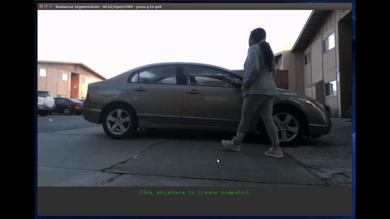

# realsense_segmentation
## Introduction
This app does semantic segmentation using the [semantic-segmentation-adas-0001](../../networks/semantic_segmentation_adas_0001/README.md), the [Intel Movidius Neural Compute Stick 2](https://software.intel.com/en-us/neural-compute-stick), [OpenVINO Toolkit R3](https://software.intel.com/en-us/openvino-toolkit) and the [Intel® RealSense™ depth camera](https://store.intelrealsense.com). The app takes color and depth frames from a video stream from the Intel RealSense depth camera (tested with [Intel RealSense D415](https://www.intelrealsense.com/depth-camera-d415/)) and performs semantic segmentation on the color frames. The semantic segmentation inference results will colorize pixels and overlay them onto the color frame. These colorized pixels represent different objects. Based on where the mouse pointer is at, the app will tell you what object and the distance to that object on a pixel by pixel basis. 




## Prerequisites
This program requires:
- 1 [NCS2](https://store.intelrealsense.com/buy-intel-neural-compute-stick-2.html)/NCS1 device
- OpenVINO 2019 R3 Toolkit
- [Intel RealSense SDK 2.0](https://github.com/IntelRealSense/librealsense)
- Intel RealSense depth camera (tested with [Intel RealSense D415](https://store.intelrealsense.com/buy-intel-realsense-depth-camera-d415.html))

Note: All development and testing has been done on Ubuntu 16.04 on an x86-64 machine.

**Realsense SDK Note**:
You can install the Intel RealSense SDK 2.0 packages by running the command: **'make install-reqs'**.
This will install the following packages:
- **librealsense2-dkms** - Deploys the librealsense2 udev rules, build and activate kernel modules, runtime library.
- **librealsense2-dev** - Includes the header files and symbolic links for developers.

## Building the Example

To run the example code do the following :
1. Open a terminal and change directory to the sample base directory
2. Connect your Intel RealSense depth camera and NCS device.
3. Type the following command in the terminal: ```make all```

**Note**: Make sure your Intel RealSense libraries are installed beforehand. 

## Running the Example

After building the example you can run the example code by doing the following :
1. Open a terminal and change directory to the sample base directory
2. Type the following command in the terminal: ```make run``` 

When the application runs normally, another window should pop up and show the feed from the Intel RealSense depth camera. The program should perform inferences on frames taken from the Intel RealSense depth camera.

**Keybindings**:
- q or Q - Quit the application


## Makefile
Provided Makefile has various targets that help with the above mentioned tasks.

### make run or make run_cpp
Runs the sample application.

### make help
Shows available targets.

### make all
Builds and/or gathers all the required files needed to run the application.

### make data
Gathers all of the required data need to run the sample.

### make deps
Builds all of the dependencies needed to run the sample.

### make install-reqs
Checks required packages that aren't installed as part of the OpenVINO installation. 

### make uninstall-reqs
Uninstalls requirements that were installed by the sample program.
 
### make clean
Removes all the temporary files that are created by the Makefile.

