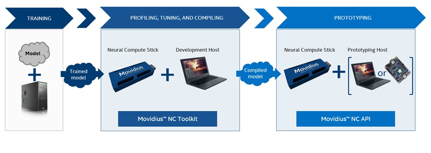

# Introduction
The Movidius™ Neural Compute SDK and Movidius™ Neural Compute Stick (NCS) enable rapid prototyping, validation and deployment of Deep Neural Networks (DNN).

The NCS in used in two primary scenarios:
- Profiling, tuning, and compiling a DNN on a development computer (host system) with the tools provided in the Movidius™ Neural Compute SDK. In this scenario the host system is typically a desktop or laptop machine running Ubuntu 16.04 Desktop (x86, 64 bit) but you can use any supported platform for these steps.

- Prototyping a user application on a development computer (host system) which accesses the hardware of the NCS to accelerate DNN inferences via the API provided with the Movidius™ Neural Compute SDK. In this scenario the host system can be a developer workstation or any developer system that runs an operating system compatible with the API. 

The following diagram shows the typical workflow for development with the NC

The training phase does not utilize the NCS hardware or SDK, while the subsequent phases of “profiling, tuning and compiling” and “prototyping” do require the NCS hardware and the accompanying Movidius™ Neural Compute SDK

The SDK contains a set of software tools to compile, profile, and check validity of your DNN as well as an API for both the C and Python programming languages.  The API is provided to allow users to create software which offloads the neural network computation onto the Movidius™ Neural Compute Stick.

# [Installation and Configuration](install.md)
# [SDK Tools](tools.md)
# [C API](c_api/c_api.md)
# [Python API](py_api/python_api.md)
# [Trouble Shooting](troubleshooting.md)
# [NCS Forum](forum.md)
. 

.
 
. 

old links below
. 

.
 
. 

# ncCompile

# ncProfile

# ncCheck

# C API

# Python API

## Global Methods

* [mvnc.EnumerateDevices](py_api/EnumerateDevices.md)
* [mvnc.Status](py_api/Status.md)

* [mvnc.GlobalOption](py_api/GlobalOption.md)
* [mvnc.SetGlobalOption()](py_api/SetGlobalOption.md)
* [mvnc.GetGlobalOption()](py_api/GetGlobalOption.md)
 
* [mvnc.Device](py_api/Class_Device.md)
  * [mvnc.Device.OpenDevice()](py_api/Device.OpenDevice.md)
  * [mvnc.Device.CloseDevice()](py_api/Device.CloseDevice.md)
 
  * [mvnc.Device.DeviceOption](py_api/Device.DeviceOption.md)
  * [mvnc.Device.SetDeviceOption()](py_api/Device.SetDeviceOption.md)
  * [mvnc.Device.GetDeviceOption()](py_api/Device.GetDeviceOption.md)
   
  * [mvnc.Device.Graph](py_api/Graph.md)
  * [mvnc.Device.AllocateGraph()](py_api/Device.AllocateGraph.md)  
  * [mvnc.Device.DeallocateGraph()](py_api/Device.DeallocateGraph.md)  
    * [mvnc.Device.Graph.LoadTensor()](py_api/Graph.LoadTensor.md)  
    * [mvnc.Device.Graph.GetResult()](py_api/Graph.GetResult.md)  
    * [mvnc.Device.Graph.GraphOption](py_api/Graph.Class_GraphOption.md)
    * [mvnc.Device.Graph.SetGraphOption()](py_api/Graph.SetGraphOption.md)  
    * [mvnc.Device.Graph.GetGraphOption()](py_api/Graph.GetGraphOption.md)  

# Examples

