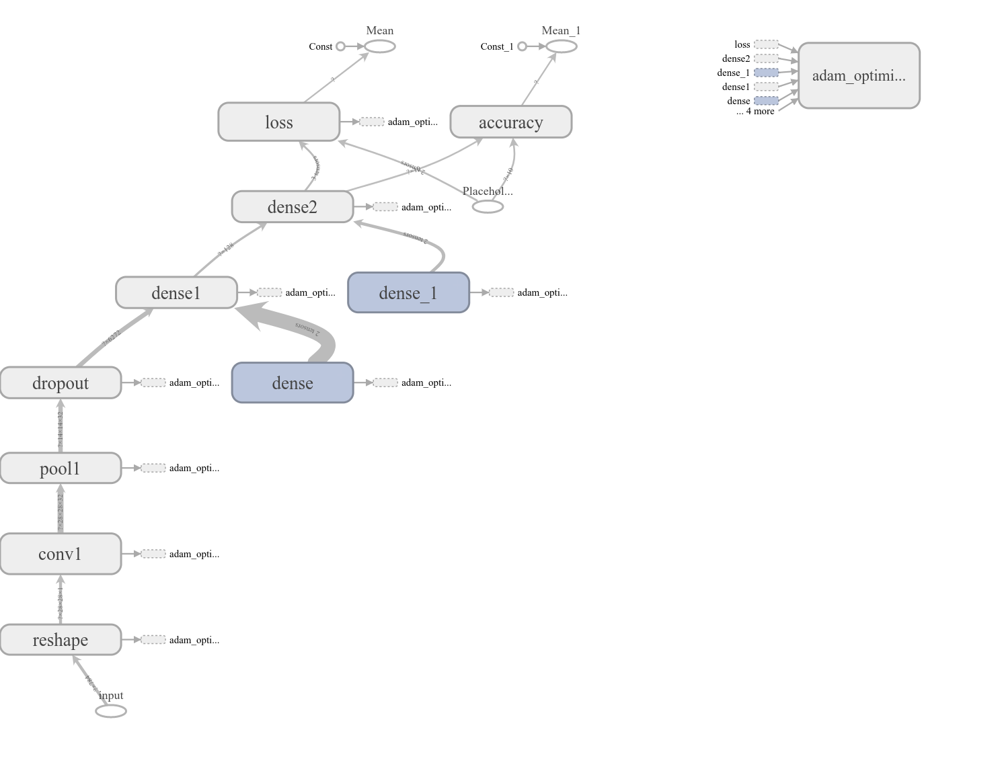

# Single Convolution for Fashion MNIST
## On Intel® Movidius™ Neural Compute Stick (NCS)

This is a TensorFlow™ implementation of a very simple convolution neural network (CNN), trained on Fashion MNIST. The model can be trained either on a CPU or GPU based system, and then deployed onto Intel® Movidius™ Neural Compute Stick (NCS) for inference.

This is a pictorial representation of the network used in this project.



> The accuracy of this network is quite low. By no means is this network proposed as a better alternative to those already listed on the Fashion MNIST website. The purpose of this project is simply to show how to deploy a custom TensorFlow neural network onto the NCS.

## Prerequisites

This sample project requires that the following componets are available:
1. <a href="https://developer.movidius.com/buy" target="_blank">Movidius Neural Compute Stick</a> (NCS)
2. <a href="https://developer.movidius.com/start" target="_blank">Movidius Neural Compute SDK</a> (NCSDK)
3. <a href="https://www.tensorflow.org/install/install_linux">TensorFlow installed</a> on a computer that is powerfull enough to run network training.
   * It could be a GPU or a CPU-Only system.

## Running the example

### Training: Download dataset, train the network and export model for inference.

Run these instructions within your tensorflow virtual environment or docker contrainer on your training hardware. In my case, it was `source ~/workspace/tensorflow/tf_env_py3/bin/activate`.

```
mkdir -p ~/workspace
cd ~/workspace
git clone https://github.com/movidius/ncappzoo
cd ~/workspace/ncappzoo/tensorflow/single-conv/
make
```

### Inference: Deploy the trained network on NCS.

Run these instructions on a system where NCSDK is installed. If NCSDK is not installed on the system where you trained and exported the model, copy `model-inference.meta` over to the system with NCSDK.

The below instructions will convert your meta file into a Movidius graph file, which can then be loaded on to the NCS.

```
mkdir -p ~/workspace
cd ~/workspace
git clone https://github.com/movidius/ncappzoo
cd ~/workspace/ncappzoo/tensorflow/single-conv/
make compile
```

Now that you have a Movidius graph file, you can use either image-classifier or rapid-image-classifier to deploy it onto the NCS and run inferences. You will have to make some changes to the default app, so that you are pointing to the right graph file and the right test image.

> Like MNIST dataset, Fashion MNIST too is provided in IDX file format, where images are represented as matrices. For inference, you can either read those matrices directly into the NCS app, or you can first convert them to png images. I did the latter.

Here is a diff of the changes I made to `~/workspace/ncappzoo/image-classifier/image-classifier.py`:

```python
 # User modifiable input parameters
 NCAPPZOO_PATH           = '../..'
-GRAPH_PATH              = NCAPPZOO_PATH + '/caffe/GoogLeNet/graph'
-IMAGE_PATH              = NCAPPZOO_PATH + '/data/images/cat.jpg'
-CATEGORIES_PATH         = NCAPPZOO_PATH + '/data/ilsvrc12/synset_words.txt'
-IMAGE_MEAN              = numpy.float16( [104.00698793, 116.66876762, 122.67891434] )
-IMAGE_STDDEV            = ( 1 )
-IMAGE_DIM               = ( 224, 224 )
+GRAPH_PATH              = NCAPPZOO_PATH + '/tensorflow/single-conv/model/graph'
+IMAGE_PATH              = NCAPPZOO_PATH + '/tensorflow/single-conv/data/testing/6/5469.png'
+CATEGORIES_PATH         = NCAPPZOO_PATH + '/tensorflow/single-conv/data/categories.txt'
+IMAGE_MEAN              = numpy.float16( 0 )
+IMAGE_STDDEV            = ( 1 / 127.5 )
+IMAGE_DIM               = ( 28, 28 )
 
 # ---- Step 1: Open the enumerated device and get a handle to it -------------
 
@@ -50,8 +50,7 @@ graph = device.AllocateGraph( blob )
 img = print_img = skimage.io.imread( IMAGE_PATH )
 img = skimage.transform.resize( img, IMAGE_DIM, preserve_range=True )
 
-# Convert RGB to BGR [skimage reads image in RGB, but Caffe uses BGR]
-img = img[:, :, ::-1]
+# MNIST dataset is monochromatic, so we don't need to worry about color conversion
```

Now run `python3 image-classifier.py` inside `~/workspace/ncappzoo/image-classifier/`. If everything went well, you should see an output similar to this:

```
------- predictions --------
Prediction for : Shirt with 22.7% confidence in 1.17 ms
Prediction for : T-shirt/top with 8.8% confidence in 1.17 ms
Prediction for : Pullover with 8.6% confidence in 1.17 ms
Prediction for : Ankle boot with 8.6% confidence in 1.17 ms
```

You should also see the image on which the inference was performed.

> You can make similar changes to `~/workspace/ncappzoo/image-classifier/rapid-image-classifier.py`, with the exception of `IMAGE_PATH = NCAPPZOO + "/tensorflow/single-conv/data/testing/3/`.
